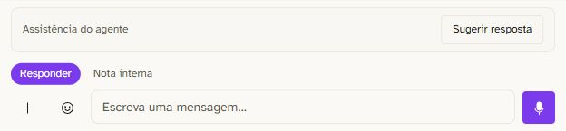
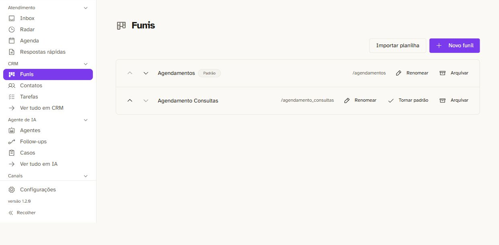
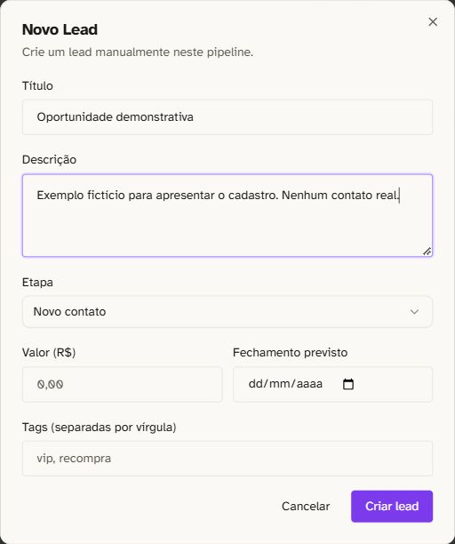
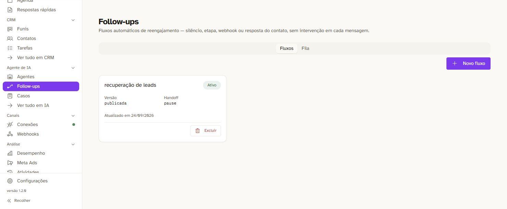
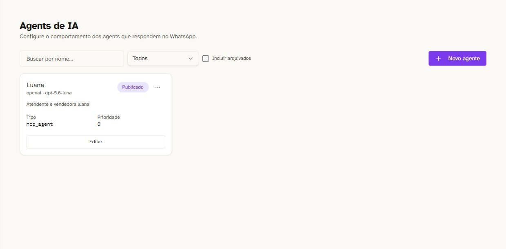
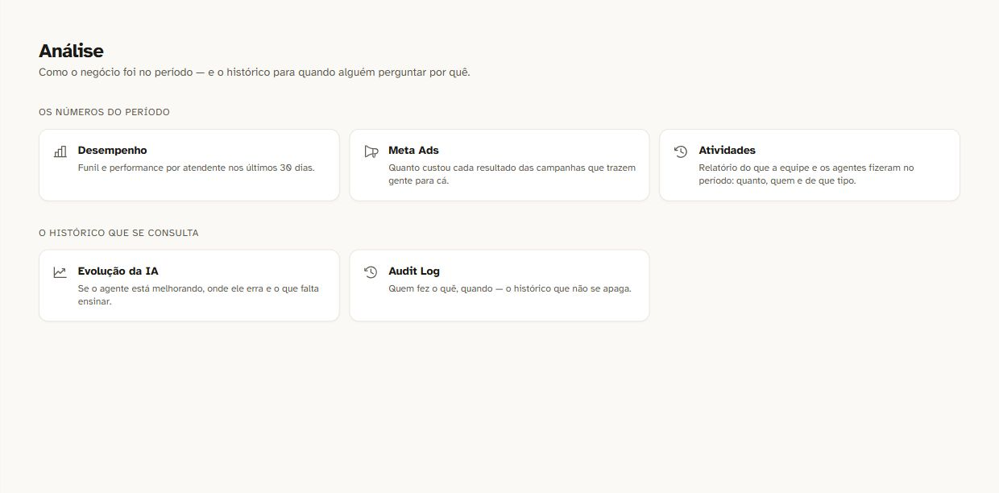
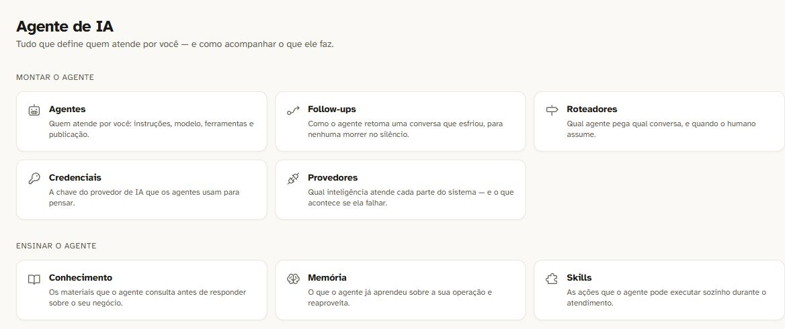
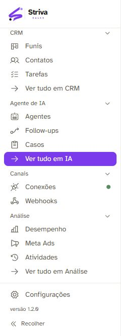

# Biblioteca visual — Striva Sales

Coleta atual autenticada em **01/10/2026**. **8 approved · 9 reference · 1 rejected.**

Consulte [o manifesto](ASSET_MANIFEST.md) antes de usar uma imagem. Ele registra funcionalidade, risco, contexto e uso recomendado. Todas as imagens são capturas diretas do produto, com recortes de privacidade.

As prévias abaixo são apenas das imagens **approved**. Cenas completas com conversas, oportunidades e compromissos fictícios continuam dependentes de uma organização demo.

## Inbox / WhatsApp — compositor

Detalhe de produto em página comercial ou apresentação: responder e registrar nota no mesmo atendimento.

[Arquivo original](approved/product/striva-inbox-compositor-2026-10-01.jpg) · 624 × 145 px

## CRM — lista de funis

Tour de CRM e explicação de múltiplos funis. Não usar como exemplo de Kanban preenchido.

[Arquivo original](approved/product/striva-crm-funis-2026-10-01.jpg) · 1242 × 612 px

## Oportunidade — formulário demonstrativo

Explicar como registrar uma oportunidade. Preservar a identificação demonstrativa.

[Arquivo original](approved/product/striva-oportunidade-cadastro-demo-2026-10-01.jpg) · 512 × 612 px

## Follow-up — biblioteca de fluxos

Apresentar a organização dos fluxos de retomada. Evitar promessa de recuperação garantida.

[Arquivo original](approved/product/striva-followup-fluxos-2026-10-01.jpg) · 1480 × 612 px

## Agentes IA — lista e publicação

Tour de configuração dos assistentes. Não usar o modelo mostrado como compromisso de disponibilidade futura.

[Arquivo original](approved/product/striva-agentes-ia-2026-10-01.jpg) · 1240 × 612 px

## Gestão — hub de análise

Visão geral dos recursos de acompanhamento e gestão, sem resultados numéricos.

[Arquivo original](approved/product/striva-gestao-hub-analise-2026-10-01.jpg) · 1240 × 612 px

## IA — montar e ensinar o assistente

Apresentar os recursos para preparar o atendimento. Usar texto comercial que explique os termos técnicos.

[Arquivo original](approved/product/striva-ia-hub-recursos-2026-10-01.jpg) · 1168 × 490 px

## Marca Striva Sales — navegação atual

Contexto de marca e navegação. Não apresentar como mapa completo de todos os módulos.

[Arquivo original](approved/product/striva-navegacao-marca-atual-2026-10-01.jpg) · 240 × 668 px

## Referências internas

- [Inbox — fila vazia](reference/product/striva-inbox-fila-vazia-2026-10-01.jpg) — Baixo de privacidade; alto de inadequação como imagem principal, pois não demonstra atendimento em andamento.
- [CRM — quadro filtrado sem contatos](reference/product/striva-crm-quadro-filtrado-vazio-2026-10-01.jpg) — Baixo de privacidade; quadro vazio e parcialmente visível, sem evidência visual de movimentação de oportunidades.
- [Follow-up — editor de fluxo publicado](reference/product/striva-followup-editor-publicado-2026-10-01.jpg) — Médio de uso comercial. Nós pequenos e partes do grafo fora do enquadramento; tempos refletem uma configuração real, não um padrão ou SLA.
- [Radar — estado operacional sem identificação](reference/product/striva-radar-operacional-2026-10-01.jpg) — Médio. Contagem e idade da demanda são dados da operação atual, não exemplos fictícios nem resultados generalizáveis.
- [Agenda — semana sem compromissos](reference/product/striva-agenda-semana-livre-2026-10-01.jpg) — Baixo de privacidade; estado vazio, texto inferior parcialmente cortado e iniciais de filtros. Não mostra rotina de agendamentos.
- [Agenda — grade diária sem compromissos](reference/product/striva-agenda-grade-diaria-vazia-2026-10-01.jpg) — Baixo de privacidade; vazio, espaço lateral e ausência de contexto. Não comprova disponibilidade externa ou sincronização Google.
- [Gestão — desempenho da instalação](reference/product/striva-gestao-desempenho-operacional-2026-10-01.jpg) — Médio/alto de uso comercial. Indicadores reais de uma instalação com base pequena; não são demonstração fictícia, benchmark, estudo de caso aprovado ou promessa de resultado.
- [Respostas rápidas — scripts de acompanhamento](reference/product/striva-respostas-rapidas-operacionais-2026-10-01.jpg) — Médio. Marca da clínica e procedimentos do nicho estão no texto; não são copy genérica da Striva. Não há dado de paciente.
- [Tarefas — lista vazia](reference/product/striva-tarefas-lista-vazia-2026-10-01.jpg) — Baixo de privacidade; ausência de tarefa concreta torna a imagem fraca para anúncio.

## Rejeitada

- [Conhecimento — material sem vínculo com assistente](rejected/product/striva-conhecimento-sem-vinculo-2026-10-01.jpg) — Alto de inadequação comercial: nenhum assistente consulta o material, rótulo de teste e título fora do recorte. Não sustenta anúncio de conhecimento operacional configurado.
